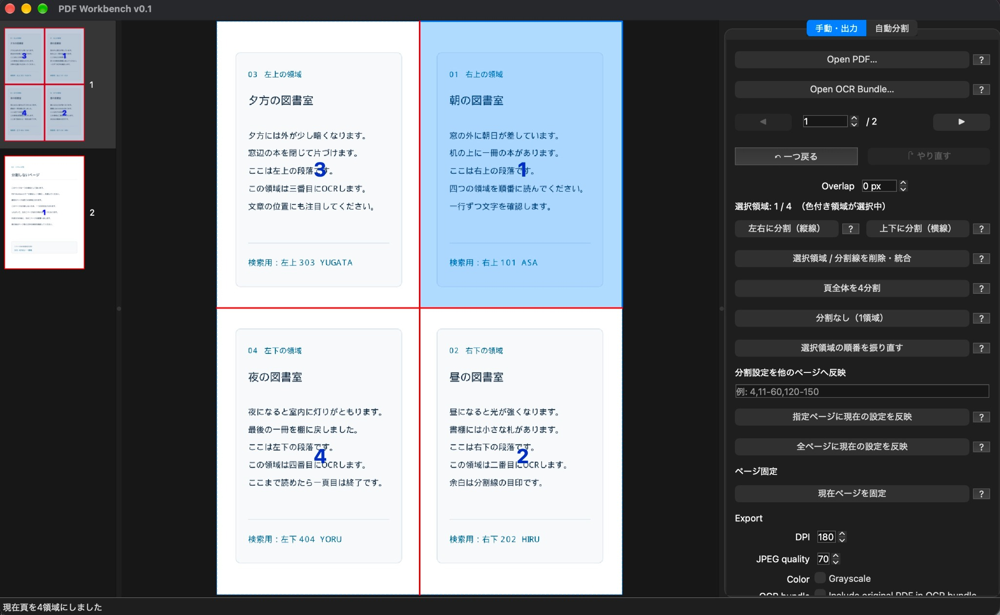
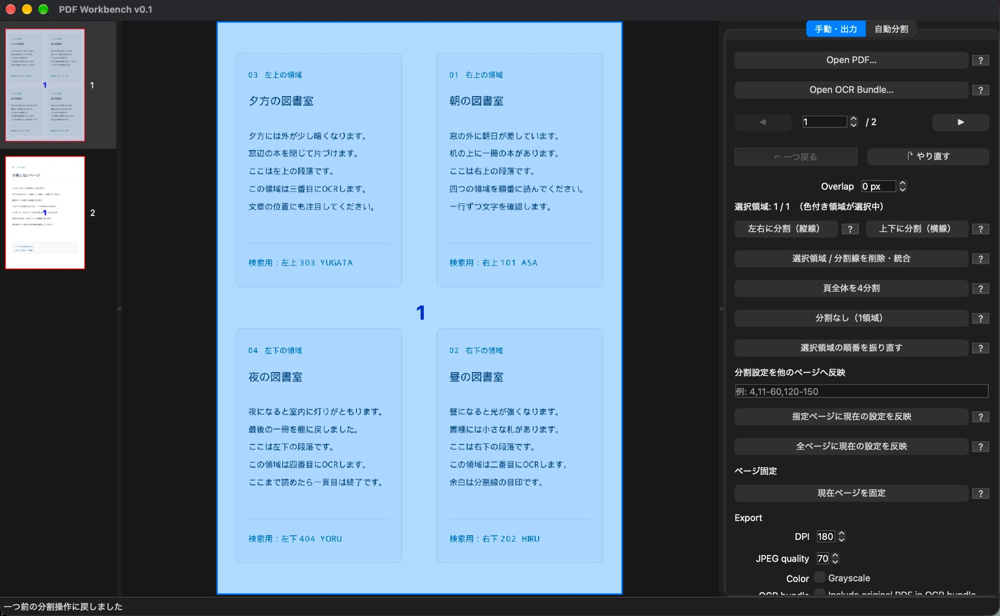
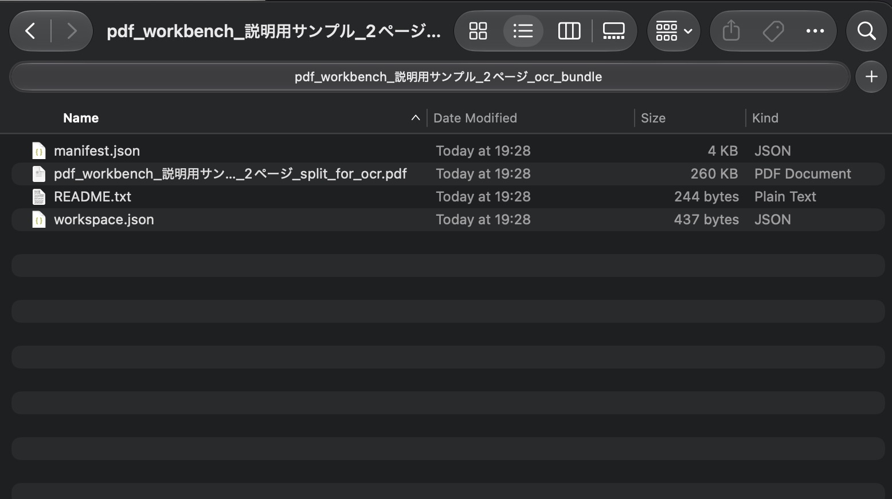
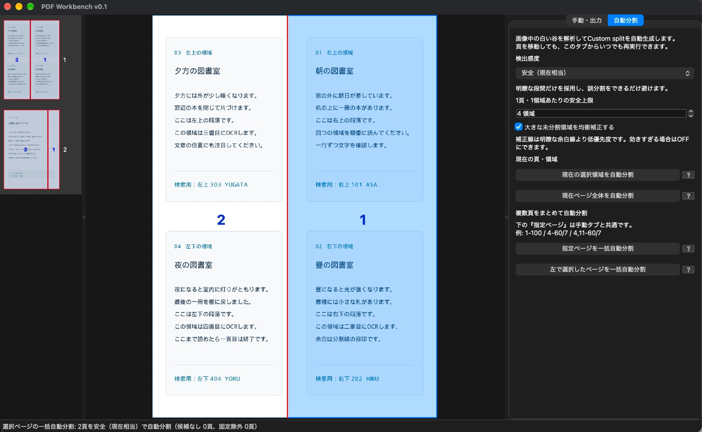
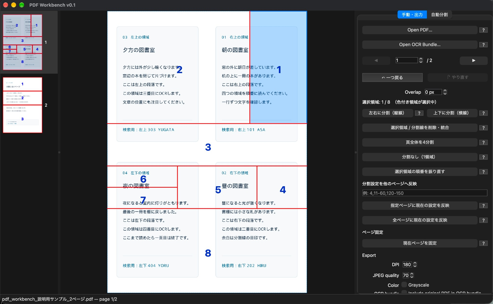

# PDF Workbench クイックスタート（日本語・画像付き）

PDF WorkbenchでPDFの分割設定を作り、**外部OCRに渡すPDFを書き出すまで**を、実際のGUI画面で説明します。PDF Workbench自体はOCRを実行しません。インストールとGUIの起動方法は[公開版README](../README.md#動作環境とインストール)を参照してください。

この手順では[説明用サンプルPDF（2ページ）](samples/pdf-workbench-demo-2pages.pdf)を使用します。1ページ目を4領域に、2ページ目を1領域にすると、**元の2ページからOCR用の5ページを作る**設定になります。サンプルは説明用の架空の文章です。

> **このサンプルには元から選択・検索できる文字が入っています。** 「外部OCRによって新しく付与された文字情報が復元後も残る」ことの証明には使えません。その検証には、別途、画像化された文字からなるPDFを使ってください。また、下の画面は2026年9月22日に撮影したPDF Workbench v0.1の例で、操作画面は今後変わる可能性があります。

## 1. サンプルPDFを開く

アプリを起動し、右側の「手動・出力」タブで **Open PDF…** を押して、上記のサンプルPDFを開きます。左側に2ページのサムネイル、中央に選択ページが表示されます。元のPDFを開いて分割設定を編集しても、元ファイルは書き換えられません。

## 2. 1ページ目を4領域にする

左のサムネイルで**1ページ目**を選び、右の「手動・出力」タブで **頁全体を4分割** を押します。青い数字はOCR用PDFに書き出す領域の順番です。このサンプルでは、**右上 → 右下 → 左上 → 左下** の順に並びます。

中央プレビュー内をクリックして⌘A（Windows/LinuxではCtrl+A）を押すと、表示中のページの全分割領域を選択できます。Escで複数選択を解除します。左側サムネイルのページ選択は変更されず、領域を選択しただけでは分割設定は変わりません。

赤い分割線をドラッグして位置を調整できます。分割線が本文に重なると文字が切れるおそれがあるため、**本文のない余白を通るように**動かしてください。選択領域をさらに分割したり、分割線を削除・統合したり、OCR出力順を変更したりすることもできます。

## 3. 2ページ目は分割しない

左のサムネイルで**2ページ目**を選び、「分割なし（1領域）」の状態にします。新しく開いたPDFの各ページは初期状態で1領域です。別の分割を試した後なら、右側の **分割なし（1領域）** を押して1領域へ戻せます。

この設定では、1ページ目の4領域と2ページ目の1領域を合わせて、OCR用PDFは**5ページ**になる想定です。

## 4. OCR Bundleを書き出す

右側の「手動・出力」タブを下へスクロールして **Export** の設定を確認し、**Export for OCR…** を押して保存先を指定します。OCR Bundle（フォルダ）が作成されます。次は、そのフォルダをFinderで開いた画面です。

主な内容は `*_split_for_ocr.pdf`（外部OCRへ渡すPDF）、`manifest.json`（各領域の対応と復元情報）、`workspace.json`（編集の再開に使う情報）、`README.txt`（簡単な案内）です。設定によっては元PDFのコピーが `source/original.pdf` として追加されます。

**まず `*_split_for_ocr.pdf` をPDFビューアで開き、実際に5ページあり、各領域の並びと切り取り位置が適切かを確認**してください。分割が意図と異なる場合は、Workbenchに戻って位置・順番を修正してから書き出し直します。

> **Bundleを他者へ渡す前に：** `workspace.json` は元PDFのローカル絶対パスを含みます。元PDFのコピーを同梱した場合は、原資料そのものも含まれます。公開・共有できる情報だけが入っているか確認してください。

## 5. 外部OCRと復元（操作案内）

`*_split_for_ocr.pdf` を任意の外部OCRソフトで処理し、検索可能なPDFを保存します。**5ページのページ数と順序を維持**し、自動的なページ端の切り落とし・回転・不均等な余白追加など、領域内の位置関係が変わる処理は避けてください。

OCR結果PDFができたらWorkbenchの **Restore OCR Results…** で、OCR BundleとOCR結果PDFを指定します。期待する構成は**OCR用5ページ → 元と同じ2ページ**です。復元後はPDFビューアでページ数、配置、検索・文字選択を確認してください。分割境界付近の文字は、OCR結果や切り取り位置によって失われる可能性があります。

**このクイックスタートの検証範囲：** 掲載画像は、元から検索可能な説明用サンプルPDFで分割編集とBundle書き出しを行った例です。このサンプル自体で外部OCR後の文字情報保持を検証したものではありません。これとは別に、2026年9月22日には画像化された縦書き機関紙（元4ページ）を使い、外部OCR後に4ページへ復元し、抽出可能なテキストが残ることを確認しました。比較・未確認事項は[READMEの検証状況](../README.md#テストと現状)に記載しています。実際に使用したOCRエンジン名・バージョン、文字欠落と検索位置の精密な比較は未記録・未実施です。

## 6. 自動分割と複雑な紙面への対応（任意）

### 自動分割を試す

「自動分割」タブでは、余白を解析して分割候補を作れます。以下はサンプルの**左右2領域を自動判定した例**です。手動で4領域にする手順の代わりとして必ず同じ結果が得られるわけではありません。実際の紙面に合わせて結果を確認・調整してください。

### 手動で複雑なレイアウトを分割する例

次の画面は、**機関紙や新聞のような複雑なレイアウトにも対応できることを示すため、同じサンプルを手動で8領域に分割した操作例**です。自動分割による過分割の例ではありません。4領域に限らず、紙面に応じて分割を追加したり、領域ごとのOCR出力順を設定したりできます。

この画像は分割操作の自由度を示すための例で、赤い分割線が一部の本文に重なっています。**実際にOCR用PDFを書き出す際は、文字が切れないよう余白へ分割線を移動するか、不要な領域を統合してください。**

---

さらに詳しい機能・制約は[公開版README](../README.md)を、開発の背景は[開発経緯と設計思想](DEVELOPMENT_BACKGROUND_JA.md)を、Bundleの形式は[保存形式と互換性](bundle-schema-migrations.md)を参照してください。
